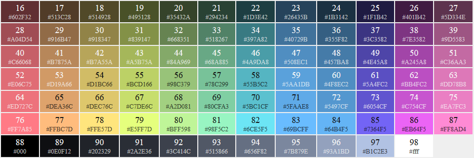
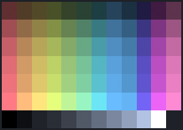
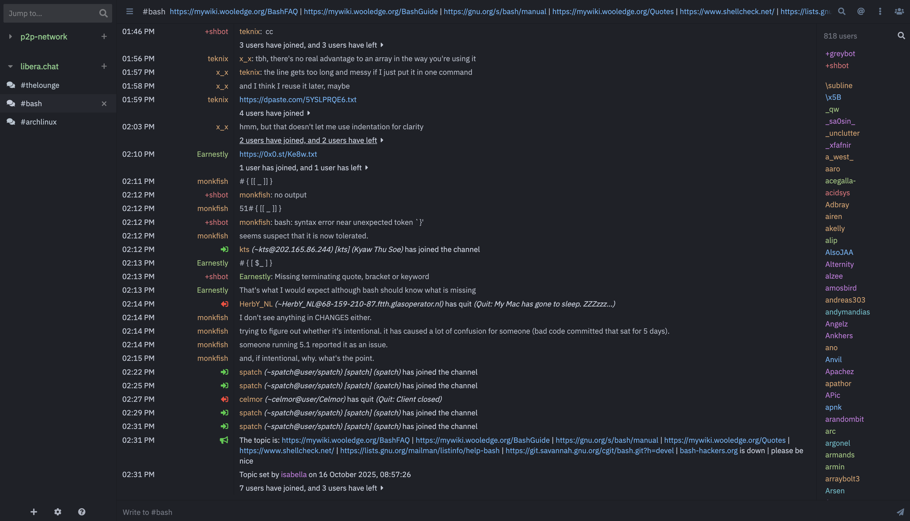

# OneDany theme for The Lounge


<!--  -->

An opinionated simple theme with OneDany colours

Source code based on the [Zenburn theme](https://github.com/thelounge/lounge/blob/master/client/themes/zenburn.css) for The Lounge by [JP Smith](https://github.com/japesinator).

Color scheme is based on the [One Dark color scheme](https://github.com/nathanbuchar/atom-one-dark-terminal) for iTerm, by [Nathan Buchar](https://github.com/nathanbuchar).

## Colors

### Colors 16-98





## Preview



## Installation

Install this theme with:

```sh
thelounge install thelounge-theme-one-dany
```
