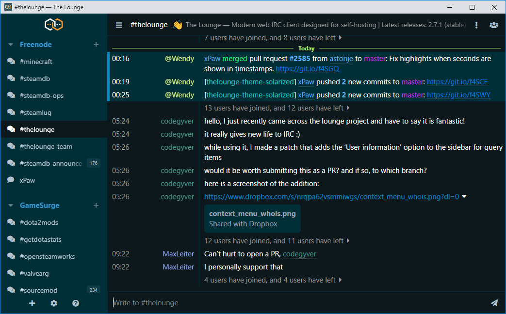

<h1 align="center">
	OneDark theme for The Lounge
</h1>

<h3 align="center">
	An opinionated simple theme with OneDark colours
</h3>

<p align="center">
	<a href="https://yarn.pm/the-lounge-theme-one-dark"></a>
	<a href="https://npm-stat.com/charts.html?package=the-lounge-theme-one-dark&from=2016-02-12"></a>
</p>

<p align="center">
	
</p>


## Installation

Install this theme with:

```sh
thelounge install the-lounge-theme-one-dark
```
